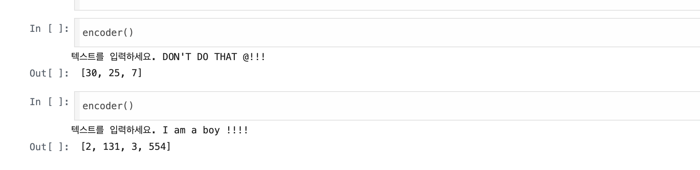
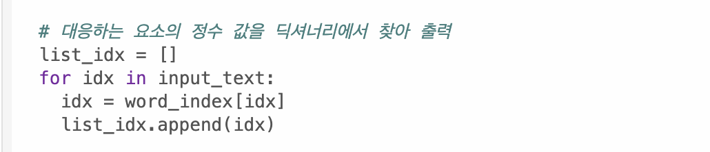
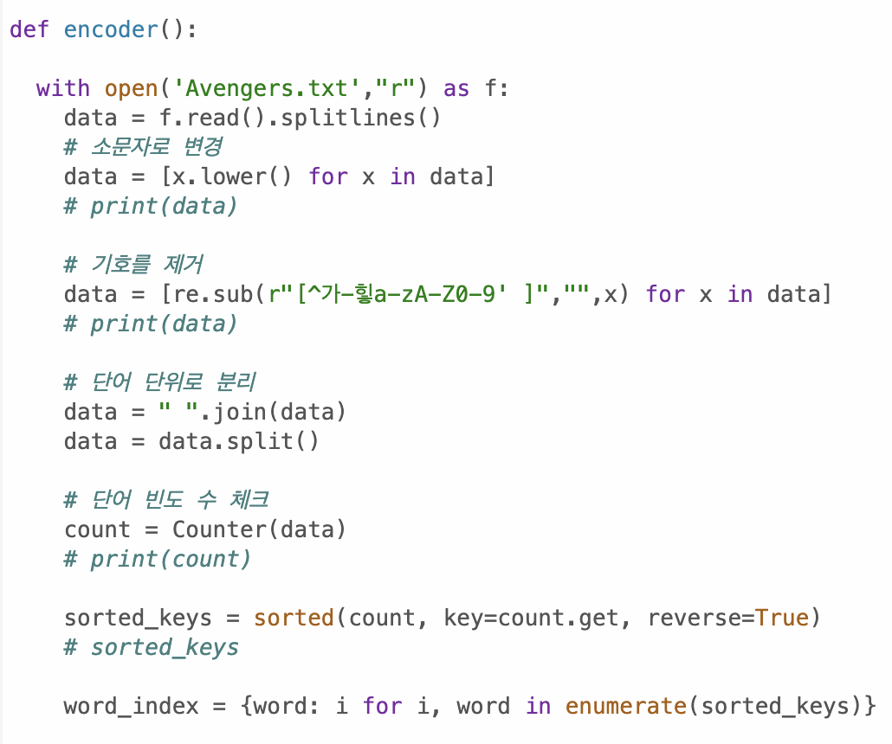
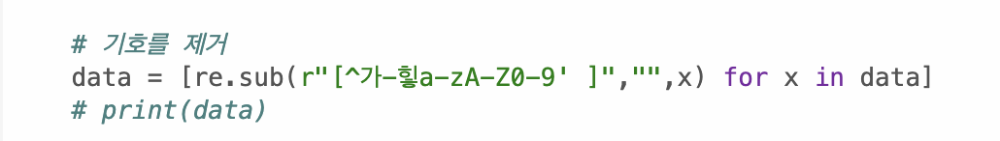

# AIFFEL Campus Online Code Peer Review Templete
- 코더 : 김선우
- 리뷰어 : 차병곤

# PRT(Peer Review Template)
- [X]  **1. 주어진 문제를 해결하는 완성된 코드가 제출되었나요?**
    - 
    
- [X]  **2. 전체 코드에서 가장 핵심적이거나 가장 복잡하고 이해하기 어려운 부분에 작성된 
주석 또는 doc string을 보고 해당 코드가 잘 이해되었나요?**
    - 하나의 로직을 구현할 때마다 주석으로 해당 코드의 의미를 자세히 기술해놓아 이해가 편했습니다. 
    - 특히 마지막으로 구현해주신 '대응하는 요소의 정수 값을 딕셔너리에서 찾아 출력'해 주신 부분이 코드가 가장 길었는데, 주석이 있어 이해가 편했습니다.
    - 
        
- [X]  **3. 에러가 난 부분을 디버깅하여 문제를 해결한 기록을 남겼거나
새로운 시도 또는 추가 실험을 수행해봤나요?**
    - 에러 히스토리는 남아있지 않았지만, 로직을 하나씩 구현해가면서 프린트로 확인해보신 기록이 남아있었습니다.
    - 
        
- [X]  **4. 회고를 잘 작성했나요?**
    - 회고는 발표를 통해 들었습니다.
    - 발표를 통해 팀원들과 원활히 소통하시며 코드를 작성하신 게 느껴졌습니다.
    - 특히 반복문으로 작성하지 않고, 컴프리헨션을 제안하신 부분이 인상깊었습니다.
        
- [X]  **5. 코드가 간결하고 효율적인가요?**
    - 컴프리헨션 문법으로 전처리 과정을 직관적으로 이해하도록 코드를 작성하셨습니다.
    - 다만, 이미 대문자를 소문자로 전처리 하셨는데, 이후 기호를 찾아 전처리하는 과정에서도 대문자를 찾는 부분은 수정 가능하지 않을까 싶습니다.
    - with 문법을 사용하여 파일을(열고 닫는 과정을) 잘 처리하였습니다.
    - 들여쓰기가 2번만 작성되었습니다. (코랩의 기본 들여쓰기가 2번이어서 그런신 듯 싶습니다.)
    - 
    - 
